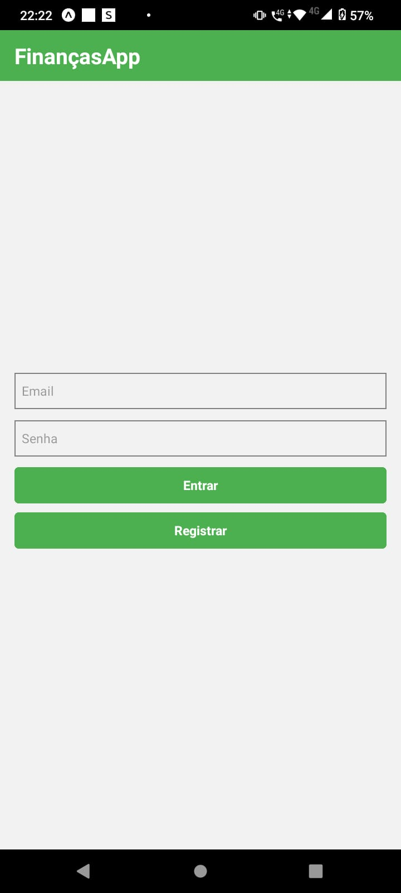
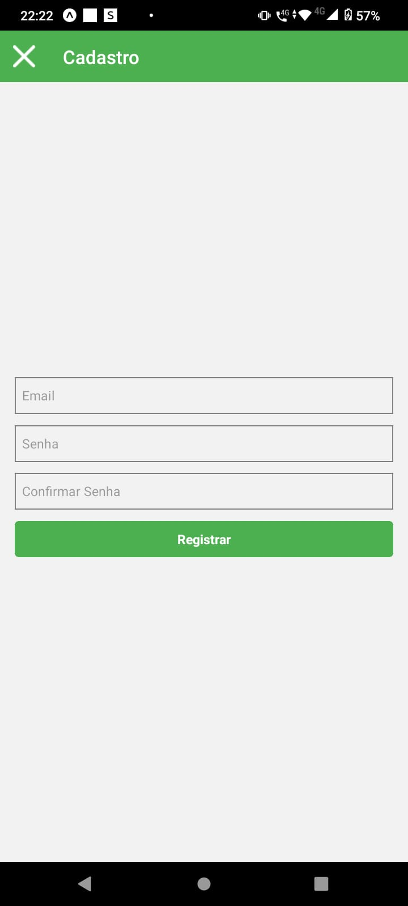
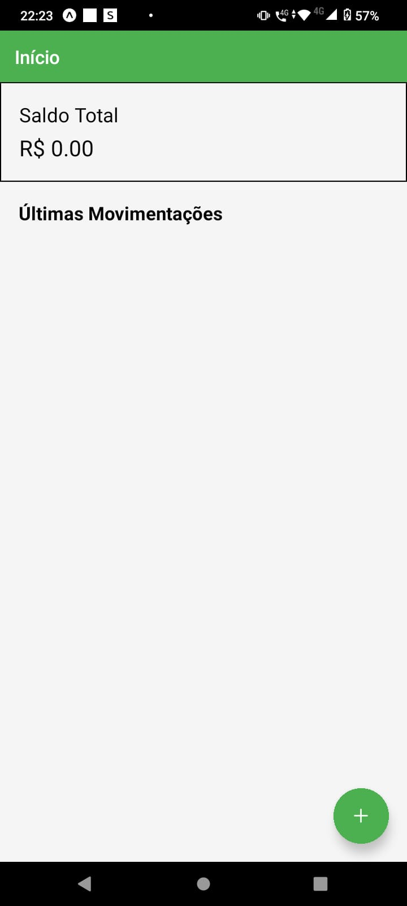
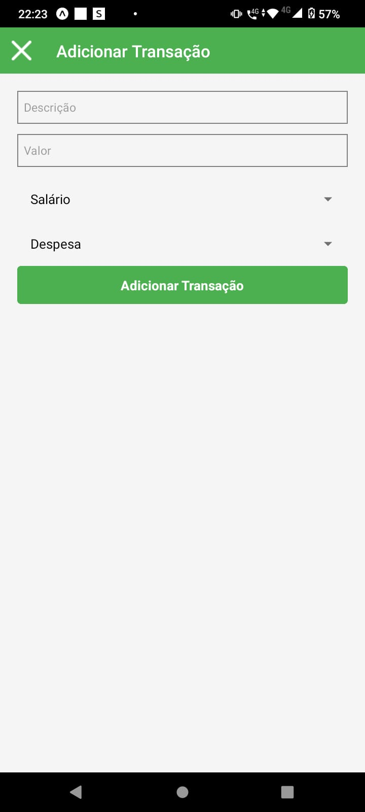
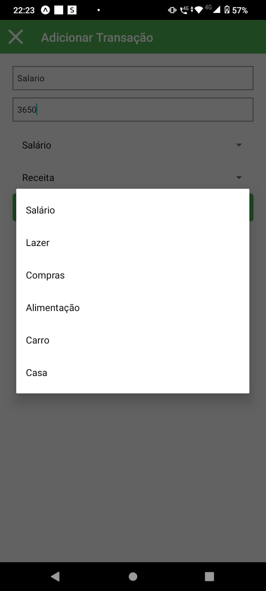
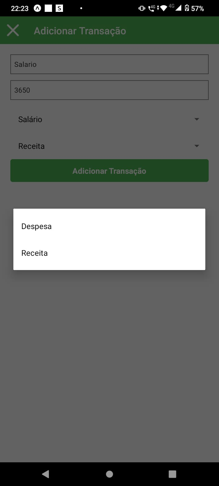
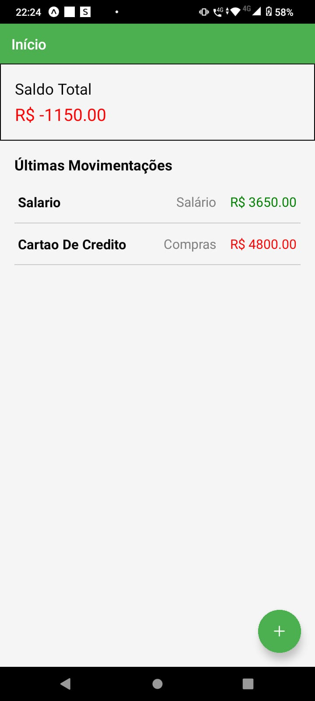

## English
# FinançasApp

FinançasApp is a financial management application developed using JavaScript. This app helps users track their expenses, manage budgets, and achieve financial goals efficiently.

# Features
- **Expense Tracking:** Record and categorize your daily expenses.
- **Budget Management:** Set and monitor budgets to control spending.
- **Financial Goals:** Define and track progress towards savings and investment goals.

## Installation

1. Clone the repository:
   ```bash
   git clone https://github.com/Igor1223/FinancasApp.git
2. Navigate to the project directory:
   ```bash
   cd FinancasApp
3. Install dependencies:
   ```bash
   npm install
4. Start the application:
   ```bash
   npm start

## Folder Structure
- **assets:** Contains images and other static assets.
- **components:** React components used in the application.
- **contexts:** Context API for state management.
- **screens:** Different screens/pages of the app.
- **App.js:** Main application component.
- **index.js:** Entry point of the application

<p float="left">

 
  
  
  
  
  
  

</p>


## Português
# FinançasApp

FinancasApp é um aplicativo de gestão financeira desenvolvido em JavaScript. Este app ajuda os usuários a rastrear suas despesas, gerenciar orçamentos e alcançar metas financeiras de forma eficiente.

# Funcionalidades
- **Rastreamento de Despesas:** Registre e categorize suas despesas diárias.
- **Gestão de Orçamento:** Defina e monitore orçamentos para controlar os gastos.
- **Metas Financeiras:** Defina e acompanhe o progresso em direção a metas de poupança e investimento.

## Instalação

1. Clone o repositório:
   ```bash
   git clone https://github.com/Igor1223/FinancasApp.git
2. Navegue até o diretório do projeto:
   ```bash
   cd FinancasApp
3. Instale as dependências:
   ```bash
   npm install
4. Inicie o aplicativo:
   ```bash
   npm start

## Estrutura de Pastas
- **assets:** Contém imagens e outros recursos estático.
- **components:** Componentes React usados no aplicativo.
- **contexts:** API de Contexto para gerenciamento de estado.
- **screens:** Diferentes telas/páginas do app.
- **App.js:** Componente principal do aplicativo.
- **index.js:** Ponto de entrada do aplicativo.

<p float="left">

 
  
  
  
  
  
  

</p>
